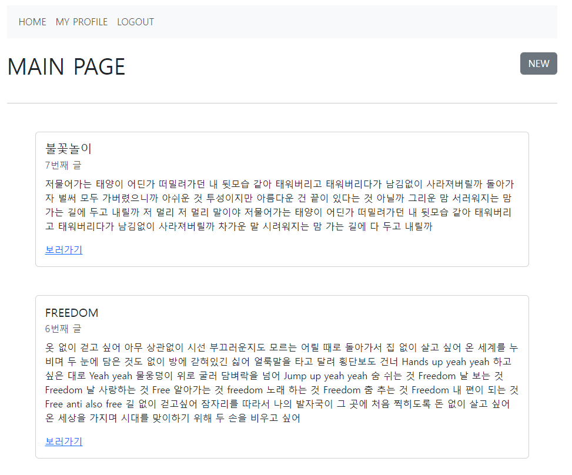
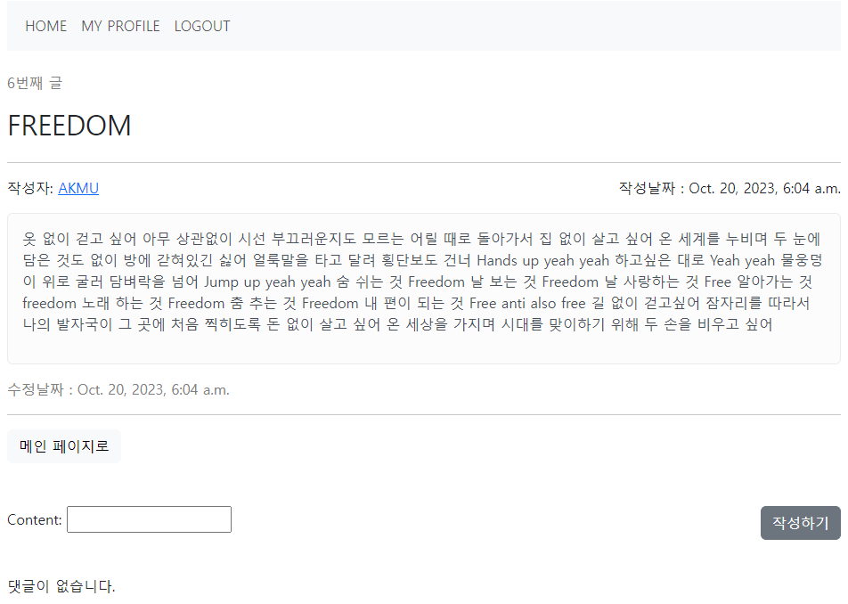
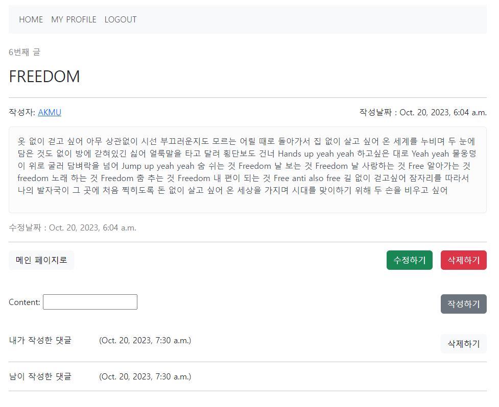
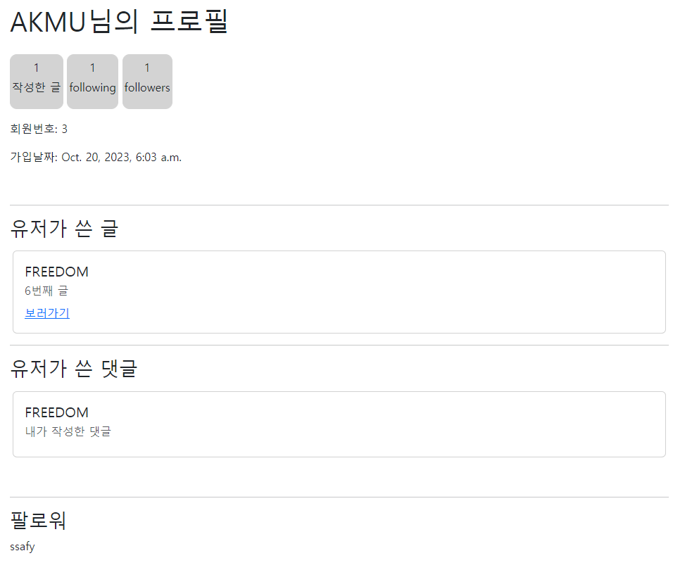
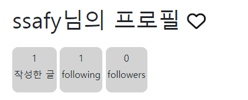
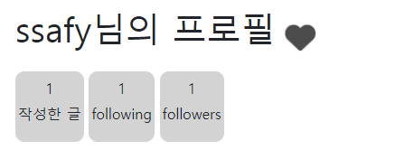

# Project 6주차 Ver1

## Main Page

CSS와 Bootstrap을 이용해 메인페이지를 작성했습니다.
- Navbar: 기본으로 메인페이지로 돌아가는 HOME
  - 로그인을 한 상태라면 내 프로필을 확인할 수 있는 MY PROFILE / LOGOUT
  - 로그인을 하지 않은 상태라면 LOGIN / SIGN IN 
- NEW: 새로운 글을 작성할 수 있습니다.
- boards: bootstrap의card를 이용해서 글의 제목, 몇번째 글인지, 내용을 알 수 있고 바로가기 버튼을 통해 상세 페이지로 넘어갈 수 있습니다.

## 상세 페이지

작성자의 이름을 눌러 작성자의 프로필 페이지를 조회할 수 있습니다.
내가 쓴 글이면 수정/ 삭제가 가능하고, 내가 쓴 댓글이면 삭제가 가능합니다
아니라면 수정 or 삭제 키가 보이지 않습니다

## 프로필 페이지
- 내 프로필

프로필에서 작성한 글의 갯수, 팔로잉, 팔로워의 수를 확인할 수 있고
해당 유저가 쓴 글, 댓글, 팔로워 목록을 확인할 수 있습니다.

- 다른 사람의 프로필

다른 사람의 프로필을 가면 이름 옆에 하트를 눌러 팔로우를 할 수 있습니다.
이미 팔로우 중이라면 채워진 하트로 바뀝니다.